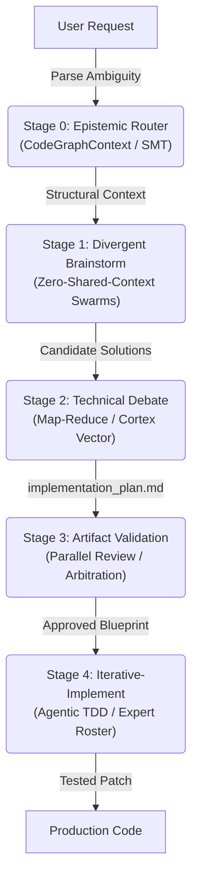
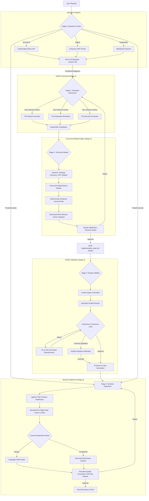

# Antigravity Core

> **The 2026 Agentic Architecture Ecosystem**

This repository contains the globally vetted **Workspace Customizations Root
Template** for Google Antigravity. It enforces enterprise-grade safety,
predictability, and observability for autonomous AI coding agents operating on
your codebase.

---

## 🏗️ The 2026 Agentic Architecture

By installing this template, you inject the **Harness-Nexus** orchestration
engine into your workspace. This transforms raw LLM execution into a structured,
self-policing loop.

### High-Level Execution Flow



### Deep Architectural Dive



### Core Protocols

1. **Harness-Nexus Consensus Loop**: Requires domain-specific subagents to
   explicitly validate and approve implementation plans before code is written.
   Uses the Hostile Adjudicator pattern to mathematically resolve deadlocks and
   prevent infinite hallucination loops.
2. **Workspace Isolation Protocol**: Forces all exploratory coding and
   structural refactoring into branched, ephemeral sandboxes to protect the
   `master` repository from state contamination.
3. **Agentic Test-Driven Development (TDD)**: Enforces a strict Red/Green
   testing loop (the Bounded Pre-Flight Gate) before agents are permitted to
   invoke code review subagents.
4. **Minimal Viable Context (MVC)**: Restricts context payloads to prevent token
   overflow and "Lost in the Middle" syndrome. Agents must actively "pull"
   context via `grep_search`.
5. **Blast Radius Containment (BRC)**: Structurally forbids agents from
   executing high-risk infrastructure mutations (e.g., dropping databases)
   without generating a `<BLAST_RADIUS>` XML payload and yielding for manual
   human authorization.
6. **Causal Telemetry**: Eliminates the "Black Box of Observability" by forcing
   agents to log a structured `[CAUSAL_TRACE]` to `agentic_telemetry.md` when
   making critical autonomous decisions.

---

## 🛠️ The Ecosystem (Included Skills)

Antigravity executes these protocols via the following dynamic skills located in
`.agents/skills`:

### Stage Orchestration

- `comprehend-problem`: The Stage 0 Epistemic Router for deterministic problem
  modeling.
- `brainstorm-solutions`: Stage 1 Divergent Brainstorming via zero-shared-context
  swarms.
- `debate` & `technical-debate`: The canonical Level 4 Map-Reduce engines for
  rigorous adversarial vetting.
- `design-validate`: Stage 2 orchestration that validates architecture artifacts.
- `iterative-implement`: Stage 4 orchestration that triggers the expert
  implementation committee.

### Governance & Linter Experts

- `markdown-style-expert`: Validates Markdown heuristics against the Google
  Markdown Style Guide.
- `style-cpp`, `style-go`, `style-java`, `style-js`, `style-python`,
  `style-rust`: Authoritative language-specific style guides and mechanical
  linters.

### Cortex & RAG Integration

- `cortex-librarian` & `textbook-librarian`: Agents querying the local Cortex
  vector database to retrieve cited architectural best practices.
- `skill-evolve`: Universal self-evolution hook that patches vulnerabilities
  into the Cortex memory when an edge-case failure occurs.

### Tooling

- `harness-scaffold`: Instantly bootstraps an unmanaged repository with testing
  infrastructure and Git isolation sandboxing.
- `restart-phone-ui`: Safely interfaces with the decoupled
  `antigravity-remote-control` Phone UI server on port `3000`.

---

## 🧩 Decoupled Sidecars

Historically, external interfaces (like the Phone UI) were embedded directly in
this repository. To enforce single-responsibility principles, sidecars are now
strictly decoupled. For example, the `antigravity-remote-control` server
operates in its own standalone repository, running on port `3000`. The core
framework interacts with it safely across process boundaries via targeted skills
(e.g., `restart-phone-ui`).

---

## 🚀 Installation (Workspace Mode)

> [!WARNING]
> To protect your personal global machine configuration from destructive
> overrides, this ecosystem is designed exclusively as a **Workspace
> Customizations Root Template**.

To install these protocols into a specific project:

1. Navigate to the root of your target project workspace.
2. Clone this repository as a submodule named `.agents`:

   ```bash
   git submodule add https://github.com/nferrer-dev/antigravity-core.git .agents
   ```

3. That's it! Antigravity will automatically discover `.agents/AGENTS.md` and
   the `.agents/skills/` directory when operating in this workspace.

> [!TIP]
> **Use Case Recommendation**: These protocols are extremely rigorous. Do not
> install this template into simple, throwaway projects (like a static HTML
> site) as the consensus loops, RAG ingestion, and test-driven requirements will
> introduce unnecessary computational overhead.
